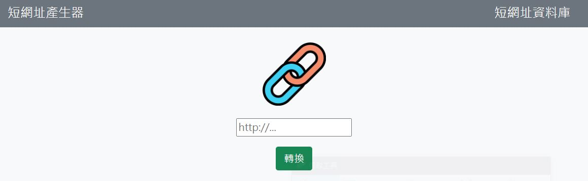
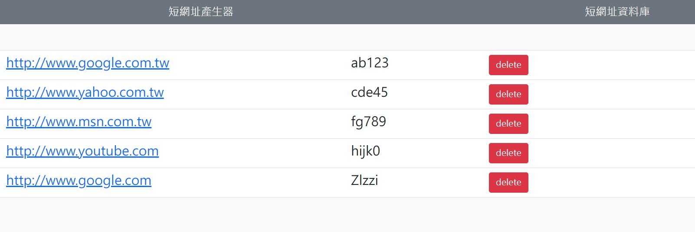

### 功能
- 輸入網址並轉換為短網址
- 產生的短網址不會重覆
- 若輸入的網址已存在資料庫中，則直接傳回資料庫中的資料
- 查閱短網址資料庫

### 安裝與執行步驟
#### 0. 請先確認已有申請 mongoDB 帳號
#### 1.將專案 clone 至本地端
```
開啟終端機(Terminal)，cd 到存放專案位置後執行：
git clone https://github.com/apolpdga/shorten-URL.git
```
#### 2.安裝 npm 套件
```
(1) cd shorten-URL   //切至專案資料夾
(2) npm install      //安裝套件 npm 套件
```
#### 3.使用 npm 安裝 express 套件
```
npm i express@4.18.2
```
#### 4.安裝 handlebars
```
npm i express-handlebars@4.0.6
```
#### 5.安裝 mongoose
```
npm i mongoose@5.13.16
```
#### 6.安裝 body-parser
```
npm i body-parser
```
#### 7.安裝 method-override
```
npm i method-override
```
#### 8.安裝 dotenv
```
npm i dotenv
```
#### 9.設定環境變數，於專案資料夾下新增.env檔案，並於檔案內MongoDB連線資料，範例如下：
```
MongoDBMONGODB_URI=mongodb+srv://<Your MongoDB Account>:<Your MongoDB Password>@cluster0.xxxx.xxxx.net/<Your MongoDB Table>?retryWrites=true&w=majority
```
#### 10.啟動伺服器
```
npm run dev 
```
#### 11.若看見下列訊息則代表順利運行，代表啟動成功
```
App is running on http://localhost:3000
mongodb connected!
```
#### 12.在瀏覽器輸入 http://localhost:3000 瀏覽內容
```
如果要暫停使用，請在終端機輸入 ctrl + c，再關閉瀏覽器 
如有需要生成種子資料請輸入以下指令: npm run seed
```


### 網站畫面

#### 首頁



